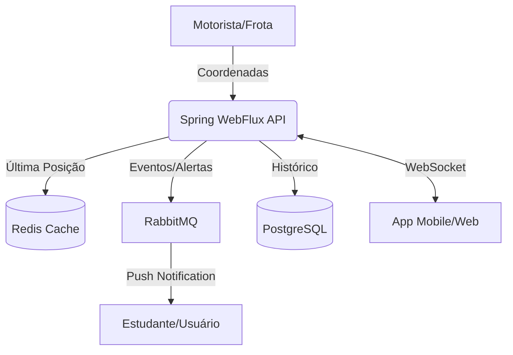

# 🚀 Travel-System | Monitoramento Reativo em Tempo Real

Bem-vindo ao repositório de documentação do **Travel-System**. Este espaço detalha as decisões de engenharia, padrões de arquitetura e a stack tecnológica utilizada na construção de uma plataforma SaaS voltada para a gestão e rastreio geolocalizado de frotas universitárias.

---

## 📌 Visão Geral: O Problema
Atualmente, alunos que dependem do transporte universitário vivem "reféns" de si mesmos devido a um fluxo de informações ineficiente e manual:

* **Dependência de Mensagens:** Necessidade de compartilhar localizações manualmente e perguntar constantemente em grupos sobre o paradeiro do transporte.
* **Vigilância Constante:** O usuário precisa estar 100% atento até o transporte chegar; qualquer distração resulta na perda da viagem e prejuízos financeiros.
* **Invisibilidade Logística:** Gestores carecem de dados sobre trajetos ou performance, dificultando a administração do serviço.

---

## 💡 A Solução
O **Travel-System** elimina a dependência de mensagens manuais e a vigilância constante, centralizando as responsabilidades no sistema com poucos cliques:

1. **Mapa em Tempo Real:** Visualização instantânea via streaming de dados, permitindo autonomia total ao aluno.
2. **Notificações Inteligentes:** Pushs automáticos informando distância do veículo, desvios de rota, imprevistos ou trânsito lento.
3. **Gestão Analítica:** Dashboards para diretores com relatórios sobre viagens, motoristas e frequência de alunos, transformando o transporte em uma operação baseada em dados.

---

## 🏗️ Arquitetura do Sistema
A aplicação utiliza o paradigma reativo para sustentar o fluxo de dados em tempo real e garantir a escalabilidade do monitoramento.

### ⚡ Engenharia e Fluxo de Dados
* **Processamento Reativo (Spring WebFlux):** Núcleo da aplicação com fluxos não-bloqueantes para gerenciar múltiplas conexões simultâneas sem gargalos de I/O.
* **Streaming de Dados (WebSockets & MapBox):** Túneis de comunicação bidirecional para envio constante de coordenadas e atualização instantânea do mapa.
* **Mensageria e Eventos (RabbitMQ):** Orquestração assíncrona para disparo de notificações push (alertas de proximidade e atrasos) e processamento de logs.
* **Persistência Híbrida (PostgreSQL & Redis):** Armazenamento relacional e histórico no **PostgreSQL**, com **Redis** atuando como cache de baixa latência para o estado da localização atual.
* **Infraestrutura e Segurança (Docker & JWT):** Containerização completa do ambiente via **Docker** e camada de segurança robusta com **Spring Security** e **JWT**.

---
### 🛠️ Backend Stack
* **Linguagem:** Java
* **Framework Principal:** Spring Boot, Spring WebFlux, Spring Data Jpa, Spring Security, Spring AMQP, Hibernate, slf4j (logging)
* **Mensageria:** RabbitMQ
* **Bancos de Dados:** PostgreSQL, Redis
* **Integração de Mapas:** MapBox API
* **DevOps:** Docker & Docker Compose
* **Migrações:** Flyway

---

---

**⚖️ Direitos Autorais e Licença**  
Este projeto é um **produto proprietário**. todos os direitos de propriedade intelectual são reservados. A reprodução, distribuição ou modificação sem autorização expressa é proibida.

Desenvolvido e mantido por **Iago**

